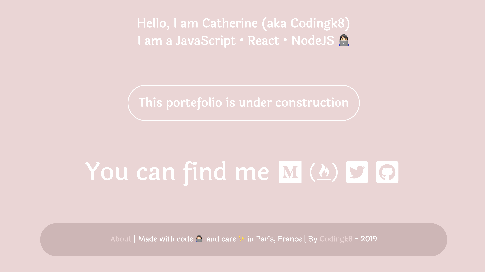

# codingk8

## Project coming for [freeCodeCamp](https://www.freecodecamp.org/) "Responsive Web Design" certification

##### Latest update: 20190226 for draft of "under construction" version

## What it does

##### [Project original description is here](https://learn.freecodecamp.org/responsive-web-design/responsive-web-design-projects/build-a-personal-portfolio-webpage)

##### Personnal additionnal Users stories: to come

##### Functionnalities (4 to 10 points)

##### [See it live](https://codingk8.github.io/)

## How it works

##### Built with:
* HTML
* CSS (+ flexbox)
* JavaScript
* [jQuery](#)
* [Google fonts](https://fonts.google.com/) for Laila font
* [Font Awesome](https://fontawesome.com/) icons

##### Directory structure

## No contribution expected

## Author

## Acknowledgements & Resources

To come

---

